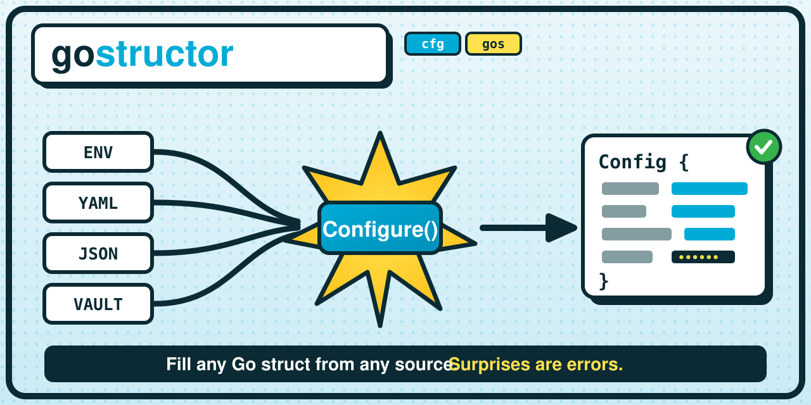

# gostructor

[](https://github.com/goreflect/gostructor/actions/workflows/ci.yaml)
[](#development)
[](https://goreportcard.com/report/github.com/goreflect/gostructor)
[](https://pkg.go.dev/github.com/goreflect/gostructor)
[](LICENSE)



**gostructor** fills the fields of a Go struct from any mix of configuration
sources — environment variables, files, HashiCorp Vault, or plain
defaults — driven by two small struct tags, in the priority order you choose
via the source list.

```go
type Config struct {
    Host  string `cfg:"host" gos:"default:0.0.0.0"`
    Port  int    `cfg:"port" gos:"default:8080"`
    Debug bool   `cfg:"debug" gos:"default:false"`
}

cfg, err := gostructor.Configure(&Config{})
```

Two tags, cleanly separated:

- **`cfg`** — *routing & naming*: `cfg:"base_name,source:override,..."`. The
  base name is what each source looks up (the env source reads `HOST` from
  `host`); a `source:override` pins a specific key for one source.
- **`gos`** — *behavior*: `gos:"default:8080,secret,optional,sep:;"` — a
  literal default, a masked-secret flag, an unresolved-is-ok flag, and a
  slice separator.

**One field, several possible sources, resolved with a priority you control**
(the order of the source list) — rather than merging every source into one map
and unmarshalling it once. A configured field that no source can resolve is a
hard error unless you mark it `gos:"optional"`: **surprises are errors**.

## What changed in v1.0

- **Two tags instead of many.** The per-source tag family (`cf_env`,
  `cf_json`, `cf_default`, `cf_secret`, ...) is replaced by one routing tag
  `cfg` and one behavior tag `gos`. Each source derives its key from the base
  name via a naming strategy (env → `SCREAMING_SNAKE`, files → the name as
  written), overridable per source in the `cfg` tag.
- **Priority is composition.** The old `cf_priority` tag and the global
  `GOSTRUCTOR_PRIORITY` selector are gone. Priority is simply the order of the
  sources you pass to `WithSources` — first source that resolves a field wins.
- `Configure[T](cfg *T, opts ...Option) (*T, error)` replaces
  `ConfigureSmart`/`ConfigureSetup`/`ConfigureEasy` and their
  `(interface{}, error)` + type-assert calling convention.
- The core module has no third-party dependencies: env vars, defaults, JSON,
  and INI are handled with the standard library and a small hand-written
  parser. YAML, TOML, HOCON, and Vault support each live in their own module,
  added via `go get` only when you need them.
- INI, HOCON, and TOML are hand-written parsers for a practical subset of
  each format (see [Known limitations](#known-limitations)); YAML stays on
  [`goccy/go-yaml`](https://github.com/goccy/go-yaml).
- Logging goes through `log/slog` via `WithLogger`; nothing is logged
  unless you pass one.
- `Source` is a two-method interface (`Name`, `Resolve`) any package can
  implement and register via `WithSources` — see `gostructor/yaml`'s
  `source.go` for a short example.

Upgrading from a pre-1.0 version: see [Migrating from v0.x](#migrating-from-v0x).

## Table of contents

- [Install](#install)
- [Quick start](#quick-start)
- [Features & live demos](#features--live-demos)
- [Supported sources](#supported-sources)
- [Supported field types](#supported-field-types)
- [The `Configure` API](#the-configure-api)
- [The `cfg` and `gos` tags](#the-cfg-and-gos-tags)
- [Sources in detail](#sources-in-detail)
  - [Defaults](#defaults)
  - [Environment variables](#environment-variables)
  - [JSON and INI (core)](#json-and-ini-core)
  - [YAML, TOML, HOCON (optional modules)](#yaml-toml-hocon-optional-modules)
  - [HashiCorp Vault (optional module)](#hashicorp-vault-optional-module)
  - [Priority: the source order](#priority-the-source-order)
- [Hooks: validation and transformation](#hooks-validation-and-transformation)
- [Logging](#logging)
- [Writing your own Source](#writing-your-own-source)
- [Known limitations](#known-limitations)
- [Migrating from v0.x](#migrating-from-v0x)
- [Roadmap](#roadmap)
- [Development](#development)
- [Contributing](#contributing)
- [License](#license)

## Install

```sh
go get github.com/goreflect/gostructor
```

That alone gets you the env, default, JSON, and INI sources with no
dependencies beyond the Go standard library. Add whichever of these you
need:

```sh
go get github.com/goreflect/gostructor/yaml    # yaml source
go get github.com/goreflect/gostructor/toml    # toml source
go get github.com/goreflect/gostructor/hocon   # hocon source
go get github.com/goreflect/gostructor/vault   # vault source
```

Requires Go 1.24+.

## Quick start

```go
package main

import (
    "fmt"
    "log"

    "github.com/goreflect/gostructor"
)

type Config struct {
    Host string `cfg:"host" gos:"default:0.0.0.0"` // env HOST, else default
    Port int    `cfg:"port" gos:"default:8080"`    // env PORT, else default
}

func main() {
    cfg, err := gostructor.Configure(&Config{})
    if err != nil {
        log.Fatal(err)
    }
    fmt.Printf("%+v\n", cfg)
}
```

`Configure` reads the `cfg`/`gos` tags on `Config`, tries each field's sources
in list order (the default list is `Env, Default`, so an env var beats the
default), and returns the same pointer you passed in — so `cfg` is both the
argument and the result. A field with no gostructor tags at all is left
untouched; a *configured* field that no source can resolve is a hard error
(unless it's `gos:"optional"`), so misconfiguration fails loudly instead of
shipping a zero value.

## Features & live demos

Each feature has a short page under [`docs/features`](docs/features/) that pairs
an explanation with a **runnable command and its real output** — copy the
command, run it against your checkout, and see the same thing. Every demo is
self-contained (writes its own temp files, cleans up after itself).

| Feature | What you get | Run it |
|---|---|---|
| [Two-tag configuration](docs/features/01-two-tags.md) | Fill a struct from `cfg` (routing) + `gos` (behavior). | `go run ./examples/basic` |
| [Priority = source order](docs/features/02-priority.md) | The same struct resolving differently per environment, from the `WithSources` order alone. | `go run ./examples/priority` |
| [Sources](docs/features/03-sources.md) | env, default, JSON, INI (core) + YAML/TOML/HOCON/Vault (modules). | `go run ./examples/filesources` |
| [Field types](docs/features/04-field-types.md) | Durations, slices, `time.Time`/`net.IP`, named types, pointers, maps, structs — strict conversion. | `go run ./examples/types` |
| [Hooks](docs/features/05-hooks.md) | Validate and transform each resolved value before it lands. | `go run ./examples/hooks` |
| [Error taxonomy](docs/features/06-errors.md) | A closed set of typed errors, classified with `errors.Is`/`errors.As`. | `go run ./examples/errors` |
| [Observability & masking](docs/features/07-observability.md) | A focused resolution trace, provenance map, masked secrets. | `go run ./examples/observability` |
| [Full service config](docs/features/08-webservice.md) | ~30 fields, nested sub-structs, JSON + env + defaults at once. | `go run ./examples/webservice` |

New here? Read the pages in order, or jump straight to
[`docs/features`](docs/features/README.md) for the guided tour.

## Supported sources

Every source shares the one `cfg` tag; the **source name** below is what you
target in a per-source override (`cfg:"port,env:DB_PORT"`) and what appears in
the resolution trace.

| Source name | Reads from | Module | Requires | Key from base name |
|---|---|---|---|---|
| `default` | Literal `gos:"default:..."` value | core | — | — (uses gos) |
| `env` | Environment variable | core | — | `SCREAMING_SNAKE` |
| `json` | JSON file | core | `GOSTRUCTOR_JSON=path/to/file.json` | name as written; `.` nests |
| `ini` | INI file | core | `GOSTRUCTOR_INI=path/to/file.ini` | global key; `section#key` overrides |
| `yaml` | YAML file | `gostructor/yaml` | `GOSTRUCTOR_YAML=path/to/file.yml` | name as written; `.` nests |
| `toml` | TOML file | `gostructor/toml` | `GOSTRUCTOR_TOML=path/to/file.toml` | top-level key; `table#key` overrides |
| `hocon` | HOCON file | `gostructor/hocon` | `GOSTRUCTOR_HOCON=path/to/file.hocon` | name as written; `.` nests |
| `vault` | HashiCorp Vault secret | `gostructor/vault` | `VAULT_ADDR`, `VAULT_TOKEN` | **override only** (`vault:path#key`) |

Non-core sources must be added explicitly via `WithSources` — the core
module has no way to know they exist (that's the whole point of the
zero-dependency core). Note the core default source list is just `Env, Default`;
file and secret sources are opt-in via `WithSources`, so a bare `cfg` base name
never triggers an unexpected file load.

## The `cfg` and `gos` tags

```go
type Config struct {
    // env SERVER_PORT (override) or JSON server.port; default 8080.
    Port     int    `cfg:"port,env:SERVER_PORT,json:server.port" gos:"default:8080"`
    // env HOST / JSON "host" from the base name; no default.
    Host     string `cfg:"host"`
    // masked in the trace; required (errors if no source has it).
    Password string `cfg:"password,vault:secret/app#pw" gos:"secret"`
    // fine to be missing: stays the zero value.
    Debug    bool   `cfg:"debug" gos:"optional"`
}
```

**`cfg` — routing & naming.** `cfg:"base_name,source:override,..."`. The first
element is the base name each source turns into its own key via a naming
strategy (env upper-snakes it; file sources use it verbatim). A `source:override`
pins an exact key for one source — use it for nested file paths
(`json:server.host`), an INI/TOML section (`ini:db#password`), a legacy env
name (`env:DB_PORT_LEGACY`), or a Vault path (`vault:secret/app#pw`).

**`gos` — behavior & metadata.** A comma-list of `key:value` meta and bare flags:

| Token | Kind | Effect |
|---|---|---|
| `default:<v>` | meta | Literal fallback, resolved by the `default` source. |
| `sep:<char>` | meta | Separator for splitting a flat value into a slice (default `,`). |
| `secret` | flag | Mask the value in the trace, logs, and `*ConvertError`. |
| `optional` | flag | Do not error when no source resolves the field. |

> Comma is the `gos` list separator, so a meta value can't contain a comma.
> For a multi-valued slice default, choose a non-comma `sep` and use it in the
> default too: `gos:"sep:|,default:a|b|c"`.

## Supported field types

- `int`, `int8`, `int16`, `int32`, `int64`
- `uint`, `uint8`, `uint16`, `uint32`, `uint64`
- `float32`, `float64`
- `string`
- `bool`
- `time.Duration`, filled from a Go duration string like `"1h30m"` (numeric
  sources are read as nanoseconds, matching `encoding/json`).
- any named scalar type (`type Level int`, `type Env string`, ...) — the
  value is converted to the field's underlying kind and keeps the named type.
- any type implementing `encoding.TextUnmarshaler` (`time.Time`, `net.IP`,
  your own enums), filled by handing it the string form.
- pointers to any of the above (`*int`, `*time.Time`, ...): the value is
  allocated and set. Multi-level pointers (`**T`) are not supported.
- slices and fixed-size arrays of any supported element type, including
  nested ones — `[]int32`, `[3]string`, `[][]int`, `[]time.Duration`.
  For an array the source must have exactly the array's length.
- `map[K]V` and `[]Struct` / `map[string]Struct`, when the source is
  structured data (JSON, YAML, TOML, HOCON) and the tag addresses a whole
  nested object rather than one leaf value. Struct elements are filled by
  matching each exported field to an object key by name, case-insensitively.
  The `env`, `default`, `ini`, and `vault` sources encode values as a flat
  string and so can only populate slices, not maps or struct elements.

Numeric conversions are **exact**: a fractional float into an integer field
(`3.9` → `int`), a value that overflows the field's width (`300` → `int8`), a
negative number into an unsigned field, and non-finite floats are all hard
errors — never silent truncation or wraparound. A conversion failure is
reported as a `*ConvertError` (see [error handling](#known-limitations)).

## The `Configure` API

```go
func Configure[T any](target *T, opts ...Option) (*T, error)
```

With no options, `Configure` uses a minimal default source list — `Env` then
`Default`. Bring in file and secret sources with `WithSources`, which replaces
the default list with an explicit, ordered one:

```go
import (
    "github.com/goreflect/gostructor"
    "github.com/goreflect/gostructor/yaml"
)

cfg, err := gostructor.Configure(&Config{}, gostructor.WithSources(
    gostructor.Env(),
    yaml.New(),
    gostructor.Default(),
))
```

Sources are tried in the order given; the first one that reports a value for a
field wins — that order **is** the priority (see
[Priority](#priority-the-source-order)). `Env()`, `Default()`, `JSON()`, and
`INI()` are built into the core module; each file source also has a
`*File(path string)` variant (`JSONFile`, `INIFile`, `yaml.File`, ...) to read
from an explicit path instead of the source's environment variable.

## Sources in detail

### Defaults

```go
type Config struct {
    Retries int    `gos:"default:3"`
    Flags   []bool `gos:"sep:|,default:true|false|true"`
}
```

`gos:"default:<v>"` is the literal default, resolved by the `default` source.
Slices split on the field separator (comma by default; a non-comma `sep` when
the value itself contains commas). There is no map syntax for defaults (see
[Supported field types](#supported-field-types)).

### Environment variables

```go
type Config struct {
    Port    int    `cfg:"port"`                   // reads PORT
    Legacy  int    `cfg:"legacy,env:OLD_PORT"`    // reads OLD_PORT (override)
    Signals []bool `cfg:"signals"`                // reads SIGNALS=true,false,true
}
```

The env source turns the base name into `SCREAMING_SNAKE_CASE` (`port` → `PORT`,
`maxConns` → `MAX_CONNS`). Pin a different variable with an `env:` override.

### JSON and INI (core)

```go
type Config struct {
    Host string `cfg:"host,json:server.host"`
    Tags []int  `cfg:"tags,json:server.tags"`
}
```

```go
cfg, err := gostructor.Configure(&Config{},
    gostructor.WithSources(gostructor.JSONFile("config.json")))
```

```json
{"server": {"host": "0.0.0.0", "tags": [1, 2, 3]}}
```

A top-level key uses the base name (`cfg:"host"` → the `host` key); a nested
value is addressed with a dotted `json:` override (`json:server.host`), no
matching nested Go struct required. A bare object key like `cfg:"server"` on a
`map[string]T` field addresses the whole nested object.

INI uses `section#key`, since INI's own structure is two levels (section, then
key). A base name reads the global, section-less part; a section value uses an
`ini:` override:

```go
type Config struct {
    Password string `cfg:"password,ini:database#password"`
}
```

```ini
[database]
password = secret
```

### YAML, TOML, HOCON (optional modules)

Each lives in its own module and mirrors JSON's addressing style (YAML) or
INI's (TOML/HOCON), targeted by its source name, and registered explicitly via
`WithSources`:

```go
import "github.com/goreflect/gostructor/yaml"

type Config struct {
    Host string   `cfg:"host,yaml:server.host"`
    Tags []string `cfg:"tags,yaml:server.tags"`
}

os.Setenv(yaml.FileEnvVar, "config.yml")
cfg, err := gostructor.Configure(&Config{}, gostructor.WithSources(yaml.New()))
```

```yaml
server:
  host: 0.0.0.0
  tags:
    - primary
    - eu-west
```

`gostructor/toml` and `gostructor/hocon` ship **hand-written parsers for a
practical subset** of each format, not the full spec — see
[Known limitations](#known-limitations) for exactly what's out of scope
before you commit a config file that needs it.

### HashiCorp Vault (optional module)

Set `VAULT_ADDR` and `VAULT_TOKEN` (the same variables the `vault` CLI
itself uses), then give each field an explicit `vault:path/to/secret#key`
override. Vault has **no** name-based default — a secret path can't be guessed
from a field name — so a field without a `vault:` override is simply skipped by
the vault source:

```go
import "github.com/goreflect/gostructor/vault"

type Config struct {
    APIKey    string  `cfg:"apiKey,vault:my-service/stage/creds#api-key" gos:"secret"`
    RateLimit int16   `cfg:"rateLimit,vault:my-service/stage/limits#rate"`
    Allowlist []int32 `cfg:"allowlist,vault:my-service/stage/net#allowlist"` // comma-separated secret value
}

cfg, err := gostructor.Configure(&Config{}, gostructor.WithSources(vault.New()))
```

Built on the official [`hashicorp/vault/api`](https://github.com/hashicorp/vault)
client, not a third-party wrapper.

### Priority: the source order

A field can be resolvable by several sources at once. There is no priority tag
and no global selector — **priority is the order of the sources you pass to
`WithSources`**. The first source that reports a value wins. To flip which
source leads for a whole config, reorder the slice:

```go
// prod: an operator's env override leads; the default is the fallback.
gostructor.Configure(&cfg, gostructor.WithSources(gostructor.Env(), gostructor.Default()))

// dev: the baked-in default leads, so a stray env var is ignored.
gostructor.Configure(&cfg, gostructor.WithSources(gostructor.Default(), gostructor.Env()))
```

The same struct resolves differently purely from the list order — see
`examples/priority` for a runnable demo.

## Hooks: validation and transformation

`WithHook` runs after a value is resolved but before it's set on the
struct — return an error to reject it, or a different value to transform
it:

```go
cfg, err := gostructor.Configure(&Config{}, gostructor.WithHook(
    func(field gostructor.FieldContext, value any) (any, error) {
        if field.Name == "Port" && value.(int) < 1024 {
            return nil, fmt.Errorf("port %v is a privileged port", value)
        }
        return value, nil
    },
))
```

## Logging

```go
logger := slog.New(slog.NewTextHandler(os.Stderr, nil))
cfg, err := gostructor.Configure(&Config{}, gostructor.WithLogger(logger))
```

With no `WithLogger`, `Configure` logs nothing.

## Observability: the resolution trace

A config layer is a black box exactly when you most need to trust it ("why is
`Port` 8080 and not what's in my file?"). `ConfigureWithReport` fills the struct
*and* returns a structured, per-field account of resolution: every source tried,
in the order tried, which one won, and the raw and converted values.

`report.String()` renders a **focused** trace — not every field, only what's
actionable: the primary source, the count of defaults, and the fields that were
overridden away from the primary config or that are secret:

```go
cfg, report, err := gostructor.ConfigureWithReport(&Config{},
    gostructor.WithSources(gostructor.Env(), gostructor.JSONFile("config.json")))
if err != nil {
    log.Fatal(err)
}
fmt.Println(report.String())
// Configuring main.Config: 4 fields
// [Primary Source] json (loaded 2 fields)
//
// Overrides & Secrets:
//   Port   int     ⇐ env (override) = 9090
//   APIKey string  ⇐ env = ••••oken (secret)

report.Provenance()    // map[string]string: field -> winning source name
report.PrimarySource() // "json": the non-default source that won the most fields
```

`report.Fields` is the machine view (`[]FieldResolution`, each with its
`Attempts` and an `IsSecret` flag); `report.String()` renders the focused
summary above. The plain `Configure` builds no report, so there's zero overhead
when you don't ask for one. `WithTrace()` logs the same report through your
`WithLogger` without changing call sites.

### Masking secrets

Flag a sensitive field with `gos:"secret"` and its value is masked everywhere
it would otherwise print — the report, trace logs, and `*ConvertError`
messages — while the real value still lands on your struct:

```go
type Config struct {
    APIKey string `cfg:"apiKey,env:APP_API_KEY" gos:"secret"`
}

// Default fully redacts ("••••••"). Override to reveal, e.g., the last 4 chars:
gostructor.WithMasker(func(_ gostructor.FieldContext, v any) string {
    s, _ := v.(string)
    if len(s) >= 4 {
        return "••••" + s[len(s)-4:]
    }
    return "••••"
})
```

See `examples/observability` for a runnable end-to-end demo.

## Writing your own Source

```go
type Source interface {
    Name() string
    Resolve(field FieldContext) (value any, found bool, err error)
}
```

`Name` is the source's identity ("yaml") and its `cfg` override key. In
`Resolve`, ask the field for your key with
`field.SourceKey("yaml", gostructor.Identity)` — that returns the `yaml:`
override if present, else your naming strategy applied to the base name, else
`""` when the field doesn't apply to you. `found=false` means "nothing to
contribute for this field", letting `Configure` fall through to the next
source instead of treating it as an error. Look at `gostructor/yaml`'s
`source.go` for a complete, short example — it's about seventy lines including
file loading and error handling.

## Known limitations

- `gostructor/hocon` and `gostructor/toml` parse a practical subset, not
  the full spec:
  - HOCON: no `${}` substitutions, no `include`, no duration/size unit
    literals (`10m`, `5 MB`), no string concatenation across values.
  - TOML: no datetimes, no inline tables (`{ a = 1 }`), no arrays of
    tables (`[[table]]`), no multiline/triple-quoted strings.

  A config file needing any of those produces a parse error rather than a
  silently wrong value. `gostructor/yaml` doesn't have this limitation —
  it wraps `goccy/go-yaml` rather than a hand-written parser.
- Nested struct sections work either flattened (an untagged struct field is
  descended into and its own tagged fields resolved individually) or whole (a
  struct field that itself carries a `cfg`/`gos` tag is filled atomically from
  one object). gostructor does not recurse *through* a pointer-to-struct field:
  `*SubConfig` is only fillable as a whole tagged value, not flattened.
- Struct fields must be exported; there's no `unsafe`-pointer trick to
  write into unexported ones, matching `encoding/json`'s convention.

### Error handling

Every error `Configure` returns belongs to one of a small, closed set of
categories, so you can tell exactly what went wrong — and whose fault it is —
without string-matching. Match the sentinels with `errors.Is` and the struct
types with `errors.As`; each struct type unwraps to its underlying cause.

| Error | When | Whose problem |
|---|---|---|
| `ErrInvalidTarget` (sentinel) | `target` isn't a non-nil pointer to a struct | the calling code |
| `*NotResolvedError` (wraps `ErrFieldNotResolved`) | a configured field (not `optional`) produced no value from any source | a missing env var / file key / secret |
| `*SourceError` | a source failed: file missing or malformed, Vault unreachable, ... | the backing store |
| `*ConvertError` | a value was produced but doesn't fit the field's type (fractional float into `int`, overflow, bad duration) | the value in the config |
| `*HookError` | a `WithHook` callback rejected the value or returned the wrong type | your validation/transform |

Every field-scoped error (`NotResolvedError`, `SourceError`, `ConvertError`,
`HookError`) implements the `FieldError` interface, so you can recover which
field failed without switching on the concrete type:

```go
type FieldError interface {
    error
    FieldName() string
}
```

```go
cfg, err := gostructor.Configure(&Config{})
switch {
case err == nil:
    // ok

case errors.Is(err, gostructor.ErrFieldNotResolved):
    var nre *gostructor.NotResolvedError
    errors.As(err, &nre)
    log.Fatalf("no value for %s (tried %s)", nre.Field, strings.Join(nre.Sources, ", "))

case func() bool { var se *gostructor.SourceError; return errors.As(err, &se) }():
    var se *gostructor.SourceError
    errors.As(err, &se)
    log.Fatalf("source %s failed for %s: %v", se.Source, se.Field, se.Unwrap())

default:
    var ce *gostructor.ConvertError
    if errors.As(err, &ce) {
        // ce.Field, ce.Value, ce.Target describe exactly what didn't fit,
        // and errors.As can reach the underlying *strconv.NumError etc.
        log.Fatalf("field %s: bad value %#v for %s", ce.Field, ce.Value, ce.Target)
    }
    log.Fatal(err)
}
```

## Migrating from v0.x

The whole tag family (`cf_env`, `cf_default`, `cf_json`, `cf_secret`,
`cf_priority`, ...) is replaced by two tags, `cfg` and `gos`. Mechanical
mapping:

| Old | New |
|---|---|
| `cf_env:"DB_PORT"` | `cfg:"port,env:DB_PORT"` (or just `cfg:"port"` → `PORT`) |
| `cf_json:"server.host"` | `cfg:"host,json:server.host"` |
| `cf_ini:"db#pw"` | `cfg:"pw,ini:db#pw"` |
| `cf_yaml`/`cf_toml`/`cf_hocon`/`cf_vault:"..."` | `cfg:"name,<source>:..."` |
| `cf_default:"8080"` | `gos:"default:8080"` |
| `cf_secret:""` | `gos:"secret"` |
| `cf_priority:"..."` + `GOSTRUCTOR_PRIORITY` | source order in `WithSources(...)` |

Other changes:

- `ConfigureSmart(cfg)` / `myStruct.(*Config)` → `cfg, err := gostructor.Configure(&Config{})`,
  no type assertion needed.
- `ConfigureSetup(cfg, prefix, []infra.FuncType{...})` →
  `gostructor.Configure(&Config{}, gostructor.WithSources(...))`.
- YAML, TOML, HOCON, and Vault now require importing their own module (see
  [Install](#install)) and passing their source explicitly via
  `WithSources` — they're no longer bundled into the core import.
- The `Source` interface method `Tag()` is now `Name()`; error fields
  `SourceError.Tag`/`NotResolvedError.Tags` are now `.Source`/`.Sources`
  (they name sources, not struct tags).
- Nested file paths are explicit dotted overrides from the document root
  (`json:server.host`); the old implicit struct-name-based prefixing is gone.
- `ChangeLogLevel`/`ChangeLogFormatter` (global `logrus` config) →
  `gostructor.WithLogger(*slog.Logger)`, passed per call.
- **Numeric conversions are now strict.** Where v0.x silently truncated a
  fractional number into an integer field or let an out-of-range value wrap
  around, v1.0 returns a `*ConvertError`. Configs that relied on `3.9` landing
  in an `int` as `3` will now fail loudly; make the field a float, or round
  the value in a `WithHook`, to keep the old behavior explicitly.

## Roadmap

See [ROADMAP.md](ROADMAP.md) for the full plan. Headlines:

- **Observability & masking** — ✅ shipped: a focused resolution trace
  (`ConfigureWithReport`) highlighting the primary source, overrides, and
  masked secrets. See [Observability](#observability-the-resolution-trace).
- **Hot reload** — a `Watchable` source interface and a `Watch` helper that
  re-fills the struct when a backing source changes.
- **Git as source of truth** — a branch/tag as a config version, snapshotted
  and polled for drift, switchable at runtime.
- **Config-server adapters** — Spring Cloud Config Server and generic
  HTTP/kv backends, each a `Source`-implementing module like Vault.
- **Ergonomics** — self-documenting config (`cf_desc` + usage text),
  whole-struct validation, custom time layouts, in-memory override source.

## Development

```sh
make build   # go build ./... in every module (core, yaml, toml, hocon, vault, examples/multisource)
make vet
make test    # go test ./... -race -cover in every module
make all     # build + vet + test
```

Test coverage (statements, library packages, excluding the runnable
`examples/`): **~89%** aggregate. Per module: core `86%`, yaml `79%`, toml
`85%`, hocon `84%`, vault `87%`, with the internal `convert`/`ini`/`structplan`
parsers each above `89%`. Reproduce with:

```sh
go test -coverpkg=$(go list ./... | grep -v /examples/ | paste -sd, -) \
    $(go list ./... | grep -v /examples/) -cover
```

Each submodule's `go.mod` carries a local `replace` directive pointing at
`../` so it builds against your working copy of core instead of a published
release; that line is a no-op for anyone importing the module normally,
since Go only applies `replace` directives from the main module of a build.

Runnable usage examples live in [`examples/`](examples/).

## Contributing

See [CONTRIBUTING.md](CONTRIBUTING.md).

## License

[MIT](LICENSE)
