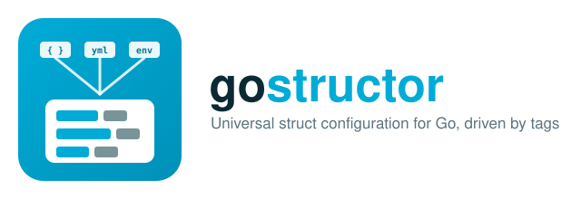

# gostructor

[](https://github.com/goreflect/gostructor/actions?query=workflow%3ACI_dev)
[](https://goreportcard.com/report/github.com/goreflect/gostructor)
[](https://codecov.io/gh/goreflect/gostructor)
[](https://pkg.go.dev/github.com/goreflect/gostructor)
[](LICENSE)



**gostructor** fills the fields of a Go struct from any mix of configuration
sources — environment variables, HOCON, JSON, YAML, INI, TOML, HashiCorp
Vault, or plain struct-tag defaults — driven entirely by struct tags. Point
one or more sources at a field and let gostructor resolve, convert, and set
the value via reflection.

```go
type Config struct {
    Host  string `cf_env:"APP_HOST" cf_default:"0.0.0.0"`
    Port  int    `cf_env:"APP_PORT" cf_default:"8080"`
    Debug bool   `cf_env:"APP_DEBUG" cf_default:"false"`
}

cfg := &Config{}
if _, err := gostructor.ConfigureSmart(cfg); err != nil {
    log.Fatal(err)
}
```

## Table of contents

- [Install](#install)
- [Quick start](#quick-start)
- [Supported sources](#supported-sources)
- [Supported field types](#supported-field-types)
- [Configuration modes](#configuration-modes)
- [Sources in detail](#sources-in-detail)
  - [Defaults](#defaults-cf_default)
  - [Environment variables](#environment-variables-cf_env)
  - [HOCON / JSON / YAML / INI / TOML](#hocon--json--yaml--ini--toml)
  - [HashiCorp Vault](#hashicorp-vault-cf_vault)
  - [Combining multiple sources with priority](#combining-multiple-sources-with-priority)
- [Logging](#logging)
- [Known limitations](#known-limitations)
- [Roadmap](#roadmap)
- [Development](#development)
- [Contributing](#contributing)
- [License](#license)

## Install

```sh
go get github.com/goreflect/gostructor
```

Requires Go 1.16+.

## Quick start

```go
package main

import (
    "fmt"
    "log"

    "github.com/goreflect/gostructor"
)

type Config struct {
    Host string `cf_env:"APP_HOST" cf_default:"0.0.0.0"`
    Port int    `cf_env:"APP_PORT" cf_default:"8080"`
}

func main() {
    cfg := &Config{}
    if _, err := gostructor.ConfigureSmart(cfg); err != nil {
        log.Fatal(err)
    }
    fmt.Printf("%+v\n", cfg)
}
```

`ConfigureSmart` inspects the tags present on the struct and automatically
builds the pipeline of sources needed to resolve it — you don't have to list
them by hand. The struct is filled in place; the returned `interface{}` is
the same pointer you passed in, so the return value only needs checking for
`nil`/type-asserting if you prefer not to keep your own reference:

```go
result, err := gostructor.ConfigureSmart(cfg)
cfg = result.(*Config) // equivalent to the cfg you already have
```

## Supported sources

| Tag | Source | Requires |
|---|---|---|
| `cf_default` | Inline default value on the tag itself | — |
| `cf_env` | Environment variable | — |
| `cf_hocon` | HOCON file | `GOSTRUCTOR_HOCON=path/to/file.hocon` |
| `cf_json` | JSON file | `GOSTRUCTOR_JSON=path/to/file.json` |
| `cf_yaml` | YAML file | `GOSTRUCTOR_YAML=path/to/file.yml` |
| `cf_ini` | INI file | `GOSTRUCTOR_INI=path/to/file.ini` |
| `cf_toml` | TOML file | `GOSTRUCTOR_TOML=path/to/file.toml` |
| `cf_vault` | HashiCorp Vault secret | `VAULT_ADDRESS`, `VAULT_TOKEN` |
| `cf_priority` | Per-field source ordering when a field carries several of the tags above | — |

`cf_server_file` and `cf_server_kv` are reserved for a future remote
config-server / key-value-store backend (Spring Cloud Config Server style).
The tags parse today but resolving them currently returns a "not implemented
yet" error — see [Roadmap](#roadmap).

## Supported field types

- `int`, `int8`, `int16`, `int32`, `int64`
- `uint`, `uint8`, `uint16`, `uint32`, `uint64`
- `float32`, `float64`
- `string`
- `bool`
- slices of any of the above, e.g. `[]int32`, `[]string`, `[]bool`
- `map[string|int]string|int|float32|float64|bool`, when the source itself is
  structured data (HOCON, JSON, YAML, INI, TOML). `cf_env` and `cf_default`
  encode values as a flat comma-separated string and so can only populate
  slices, not maps.

## Configuration modes

gostructor exposes three entry points, all built on the same pipeline
internals:

- **`ConfigureSmart(structure)`** — reads every tag on the struct and derives
  the pipeline automatically. This is the one to reach for by default.
- **`ConfigureSetup(structure, prefix, []infra.FuncType)`** — you list the
  sources explicitly, in the order they should be tried:

  ```go
  myStruct, err := gostructor.ConfigureSetup(&Config{}, "", []infra.FuncType{
      infra.FunctionSetupEnvironment,
      infra.FunctionSetupHocon,
      infra.FunctionSetupDefault,
  })
  ```
- **`ConfigureEasy(structure)`** — a fixed convenience pipeline equivalent to
  `ConfigureSetup` with `env → hocon → default`, for the common case where
  that's all you need.

All three return `(interface{}, error)`; on success the `interface{}` is the
same struct pointer you passed in, type-asserted back to your struct type if
you want it:

```go
cfg := myStruct.(*Config)
```

## Sources in detail

### Defaults (`cf_default`)

```go
type Config struct {
    Retries int      `cf_default:"3"`
    Flags   []bool   `cf_default:"true,false,true"`
}
```

The tag value is the literal default. Slices are comma-separated; there is
no map syntax for defaults (see [Supported field types](#supported-field-types)).

### Environment variables (`cf_env`)

```go
type Config struct {
    Port    int    `cf_env:"APP_PORT"`
    Signals []bool `cf_env:"MY_SIGNALS"` // e.g. MY_SIGNALS=true,false,true
}
```

### HOCON / JSON / YAML / INI / TOML

Point gostructor at a file via the matching `GOSTRUCTOR_*` environment
variable, then tag fields with the source's key (INI/TOML additionally
support `section#key`):

```go
type Config struct {
    Host string   `cf_yaml:"server.host"`
    Tags []string `cf_yaml:"server.tags"`
}
```

```go
os.Setenv(tags.YamlFile, "config.yml")
cfg, err := gostructor.ConfigureSmart(&Config{})
```

```yaml
server:
  host: 0.0.0.0
  tags:
    - primary
    - eu-west
```

Nested maps in YAML/JSON are flattened to dotted keys internally
(`server.host`), which is why the tag above reads `server.host` rather than
requiring a nested struct.

### HashiCorp Vault (`cf_vault`)

Set `VAULT_ADDRESS` and `VAULT_TOKEN`, then tag fields as `path/to/secret#key`:

```go
type Config struct {
    APIKey    string  `cf_vault:"my-service/stage/creds#api-key"`
    RateLimit int16   `cf_vault:"my-service/stage/limits#rate"`
    Allowlist []int32 `cf_vault:"my-service/stage/net#allowlist"` // comma-separated secret value
}
```

### Combining multiple sources with priority

A field can carry several source tags at once; by default gostructor tries
them in a fixed internal order. To control that order per field, add
`cf_priority` and set `GOSTRUCTOR_PRIORITY` to the name of the stage you want:

```go
type Config struct {
    Value string `cf_env:"MY_VALUE" cf_default:"fallback" cf_priority:"prod:cf_env,cf_default;dev:cf_default,cf_env"`
}
```

```go
os.Setenv("GOSTRUCTOR_PRIORITY", "prod") // tries cf_env first, falls back to cf_default
```

## Logging

gostructor logs through [`logrus`](https://github.com/sirupsen/logrus) at
`ErrorLevel` by default:

```go
gostructor.ChangeLogLevel(logrus.DebugLevel)
gostructor.ChangeLogFormatter(&logrus.JSONFormatter{})
```

These calls affect the global `logrus` logger, so treat them the same as any
other process-wide logging configuration — set them once, early, rather than
per call site.

## Known limitations

This library has been around a while and predates several ideas it would be
built with today. In the interest of not surprising anyone:

- **Middleware hooks are not wired up yet.** An `IMiddleware` interface
  exists for validating/transforming values as they're read, but there's no
  registry or dispatch behind it yet — it's a placeholder for now, not a
  usable extension point.
- **Remote config sources are not implemented.** `cf_server_file` and
  `cf_server_kv` (config-server and key/value-store backends) parse but
  return an explicit "not implemented yet" error when resolved.
- **Error values are plain `errors.New`, not wrapped/typed.** You can't
  `errors.Is`/`errors.As` against specific gostructor failure modes today —
  match on the message if you need to branch on error type.
- **A couple of upstream dependencies are pre-1.0** (`goreflect/go_hocon`,
  `mittwald/vaultgo`), so HOCON and Vault support inherit whatever stability
  guarantees those projects currently offer.

None of the above affects the documented, tested paths — `cf_default`,
`cf_env`, `cf_hocon`, `cf_json`, `cf_yaml`, `cf_ini`, `cf_toml`, and
`cf_vault` are all exercised by the test suite for both base and complex
(slice/map) field types.

## Roadmap

- [ ] File-store fetching for remote configuration
- [ ] Key/value store backend support (`cf_server_kv`), with change callbacks
- [ ] Config-server fetching in the style of Spring Cloud Config Server
      (`cf_server_file`)
- [ ] A real middleware dispatch/registry behind `IMiddleware`
- [ ] Typed/wrapped errors (`errors.Is`/`errors.As` support)

Longer-term ideas, not yet scheduled:

- Live-reloading a struct's values when its backing source changes (e.g.
  watching a git-tracked config file, à la Spring Cloud Config)
- A `protoc` plugin to generate structs with gostructor tags pre-applied

## Development

```sh
go build ./...
go vet ./...
go test ./... -cover
```

## Contributing

Issues and pull requests are welcome. If you're picking up one of the
roadmap items above or fixing a bug, a short description of the approach in
the PR body is appreciated so reviewers don't have to reverse-engineer
intent from the diff.

## License

[MIT](LICENSE)
